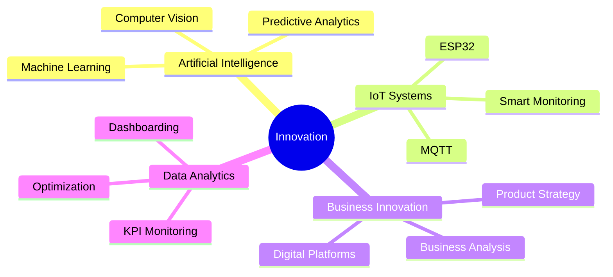

<div align="center">

# Abdullah Fazhriel Ilmy


<br>


</div>

---

## 🚀 About Me

I am a Mechatronics & Artificial Intelligence student passionate about building technology-driven solutions that solve real-world business problems.

My focus is not only on developing technology but also on transforming operational challenges into measurable business impact through:

- Artificial Intelligence
- Industrial IoT
- Computer Vision
- Data Analytics
- Predictive Systems
- Digital Transformation
- Product Innovation

---

## 🌎 Vision

> Bridging Technology, Business, and Innovation to Create Sustainable Industrial Impact.

I aspire to become a Digital Transformation Leader capable of designing enterprise-scale solutions that improve efficiency, productivity, profitability, and sustainability.

---

## 🛠 Technology Stack

<p align="center">


</p>

---

## 📊 Digital Transformation Domains



---

## ⭐ Featured Projects

### 🔍 VisionQC
AI-powered quality inspection platform using Computer Vision and real-time defect analytics.

### 🌱 EcoMine
Smart energy optimization and sustainability monitoring system for mining operations.

### 🚛 TruckConnect
Digital B2B ecosystem connecting truck buyers, dealers, financing institutions, and after-sales services.

### 💰 FINATRA
AI-driven financial intelligence platform for credit risk assessment and customer insights.

### 📦 PayloadSense
AI-powered payload monitoring and optimization system for logistics and heavy equipment operations.

### 🧺 Pilah-In
Industrial IoT platform for smart laundry monitoring, machine utilization tracking, and operational automation.

---

## 📈 GitHub Analytics

<p align="center">


</p>

---

## 🔥 Contribution Activity

<p align="center">


</p>

---

## 🎯 Current Focus

```text
✓ AI-Powered Industrial Solutions
✓ Digital Transformation Strategy
✓ Business Innovation Competitions
✓ Industrial IoT Development
✓ Product Management & Consulting
✓ Enterprise Technology Architecture
```

---

## 🤝 Connect With Me

<p align="center">

<a href="https://linkedin.com/in/YOUR_LINKEDIN">

</a>

<a href="mailto:YOUR_EMAIL">

</a>

<a href="https://github.com/YOUR_USERNAME">

</a>

</p>

---

<div align="center">


</div>
