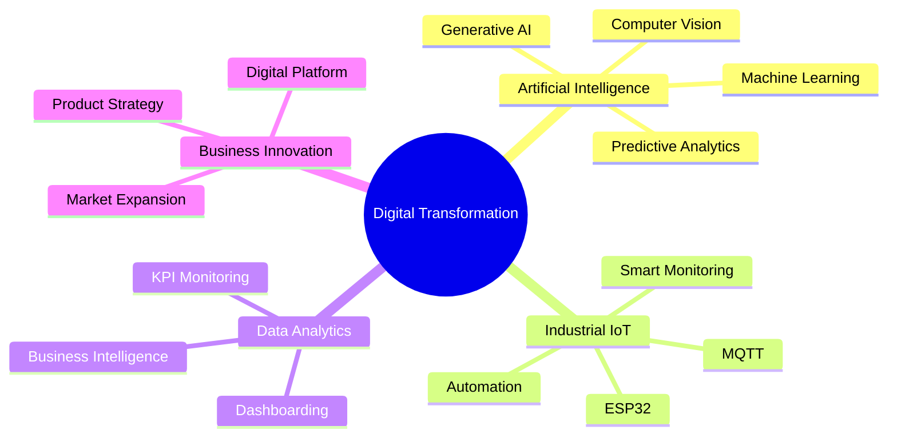

<div align="center">


<br>


<br>


</div>

---

# 👋 About Me

```yaml
Name: Abdullah Fazhriel Ilmy

Education:
  Major: Mechatronics & Artificial Intelligence

Current Mission:
  Design AI-driven and IoT-powered solutions
  that solve operational challenges and
  generate measurable business impact.

Core Focus:
  - Artificial Intelligence
  - Industrial IoT
  - Computer Vision
  - Data Analytics
  - Product Innovation
  - Business Strategy
  - Digital Transformation

Career Vision:
  Become a Digital Transformation Leader
  bridging technology, business, and innovation.
```

---

# 🌎 Vision Statement

> Building enterprise-ready digital solutions that transform operational challenges into measurable business value through Artificial Intelligence, Industrial IoT, Data Analytics, and Strategic Innovation.

---

# 🚀 Current Focus

```text
✓ AI-Powered Industrial Solutions
✓ Digital Transformation Strategy
✓ Business Innovation Competitions
✓ Industrial IoT Development
✓ Product Management & Consulting
✓ Enterprise Technology Architecture
✓ Astra Digital Astranauts Competition
```

---

# ⚡ Technology Stack

<div align="center">


</div>

---

# 📊 Digital Transformation Domains



---

# ⭐ Featured Projects

<table>
<tr>
<td width="50%">

### 🔍 VisionQC
AI-Powered Quality Inspection Platform

### 🌱 EcoMine
Mining Sustainability & Energy Optimization

### 🚛 TruckConnect
Commercial Vehicle Digital Marketplace

</td>

<td width="50%">

### 💰 FINATRA
Financial Intelligence Platform

### 📦 PayloadSense
Payload Optimization System

### 🧺 Pilah-In
Industrial IoT Smart Laundry Platform

</td>
</tr>
</table>

---

# 🏆 Innovation Portfolio

| Project | Domain | Impact |
|----------|----------|----------|
| VisionQC | Computer Vision | Quality Improvement |
| EcoMine | Sustainability | Energy Optimization |
| TruckConnect | Digital Platform | Revenue Growth |
| FINATRA | Financial Analytics | Risk Reduction |
| PayloadSense | AI Optimization | Productivity Increase |
| Pilah-In | Industrial IoT | Operational Efficiency |

---

# 📈 GitHub Analytics

<div align="center">


</div>

---

# 🔥 Contribution Streak

<div align="center">


</div>

---

# 🌌 Contribution Activity

<div align="center">


</div>

---

# 🏅 Achievement Wall

<div align="center">


</div>

---

# 📡 Connect With Me

<div align="center">

<a href="mailto:ilmyfazhriel@gmail.com">

</a>

<a href="https://github.com/afazhriel">

</a>

<a href="https://linkedin.com/in/afazhriel">

</a>

</div>

---

# 💡 Philosophy

> Technology is not the goal. Impact is the goal.

> Build solutions that solve real problems, create measurable value, and drive meaningful transformation.

---

<div align="center">


</div>


<!-- PROFILE SUMMARY -->

<p align="center">

</p>
